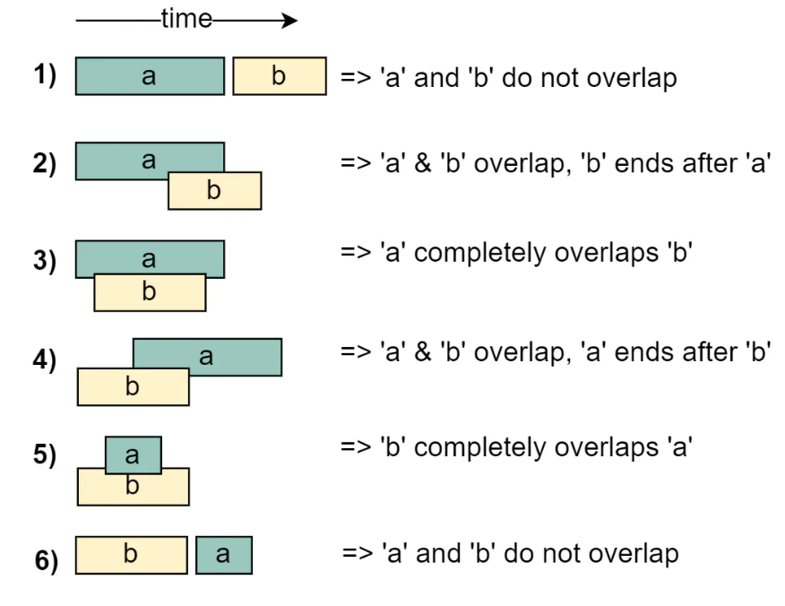

# Pattern Notes
## Pattern: Two Pointers
In general this technique requires you to work with sorted arrays.

When moving pointers, sometimes if you want to skip duplicate elements you use following structure:
```python
    # Move pointers if same value to avoid duplicates.
    while p1 < p2 and arr[p1] == arr[p1 - 1]:
        p1 += 1  # skip same element to avoid duplicate triplets
    while p1 < p2 and arr[p2] == arr[p2 - 1]:
        p2 -= 1  # skip same element to avoid duplicate triplets
```

## Pattern: Fast & Slow Pointers
This approach is quite useful when dealing with cyclic LinkedLists or arrays. By moving at different speeds (say, in a cyclic LinkedList), the algorithm proves that the two pointers are bound to meet. The fast pointer should catch the slow pointer once both the pointers are in a cyclic loop. One of the famous problems solved using this technique was Finding a cycle in a LinkedList. 

A nice problem is happy_number_v2.py. Where you use the concepts of linked list without actually using a linked list to solve a problem.

## Pattern: Sliding Window
Think about this pattern when you read "subarray" (or sublists).

## Pattern: Merge Intervals
In a lot of problems involving intervals, we either need to find overlapping intervals or merge intervals if they overlap.

Understanding the below six cases will help us in solving all intervals related problems.



Can be very helpful to define a class like the following to avoid using list accessors for readability:
```python
class Interval:
    def __init__(self, start, end):
        self.start = start
        self.end = end

    def __eq__(self, other):
        return (isinstance(other, Interval) and
                self.start == other.start and
                self.end == other.end)
```


## Pattern: Cyclic Sort
This pattern describes an interesting approach to deal with problems involving arrays containing numbers in a given range. In these problems you use the fact that the input array contains numbers in the range of 1 to n.
